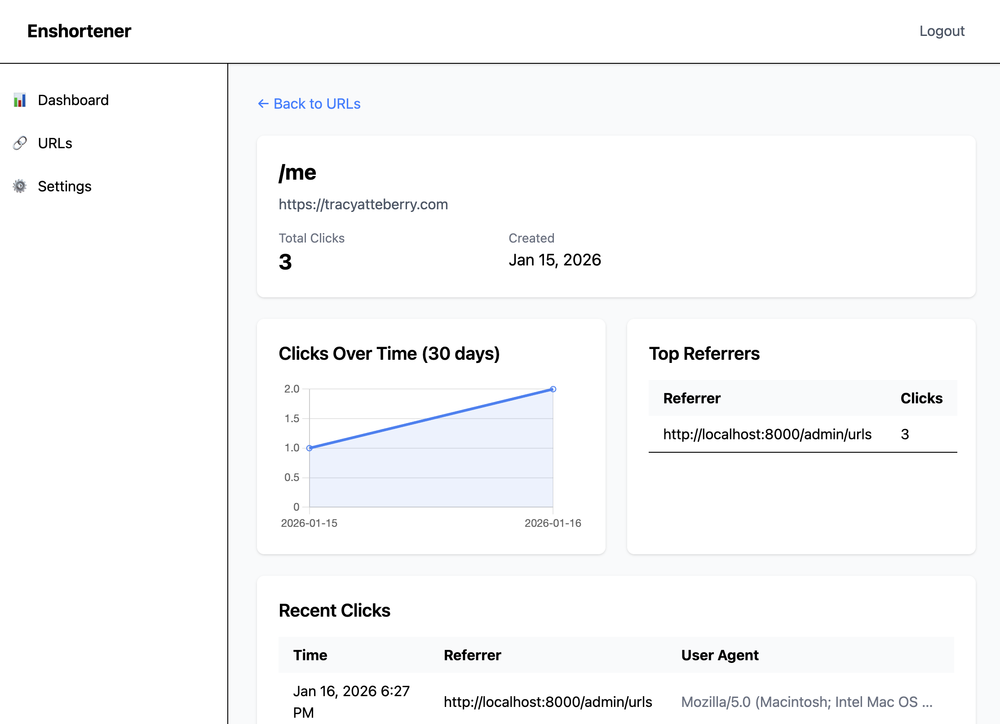

# Enshortener

A self-hosted URL shortener with click analytics, built for personal use on shared hosting.

## Overview

Enshortener lets you create short URLs with custom slugs and track clicks with referrer and user agent analytics, all from a clean admin interface. It's built to be simple and secure: copy the files to your server, visit `/admin`, and you're up and running. Data lives in a single SQLite database, so there's no separate database server to manage.



The admin interface supports light, dark, and system (follows OS preference) themes. Your choice is saved in the browser's local storage and persists across sessions, and you can change it any time in Settings > Appearance.

Security touches include bcrypt password hashing, CSRF protection on all forms, prepared statements against SQL injection, and output escaping against XSS.

## Stack

PHP 8.1+, SQLite3, Tailwind CSS

## Setup

**Requirements:**

- PHP 8.1 or higher
- SQLite3 extension
- Apache with .htaccess support (or equivalent)

**Development requirements:**

- Node.js 18+ and npm, for building the Tailwind CSS

### First-time setup

1. Upload all files to your web server.
2. Make sure `database.sqlite` is writable (`chmod 666 database.sqlite`).
3. Visit `/admin` in your browser.
4. Set your admin password on the setup screen, then log in.

For local development, install the npm dependencies so the Tailwind watcher has what it needs:

```bash
npm install
```

The built `css/compiled.css` file is committed to the repo, so you don't need to build CSS just to deploy. The pre-built CSS is ready to use as-is.

### Using the app

Once you're logged into `/admin`, click "Create New URL" to shorten a link, optionally with a custom short code. To see how a link is performing, open the URLs page and click "Analytics" next to it for clicks over time, top referrers, and recent clicks.

## Tasks

Run `pitchfork start` to run the app locally. It starts two daemons:

- `web`: serves the app with PHP's built-in server at `http://localhost:8000`, with the home page at `/`, the admin panel at `/admin`, and short URL redirects at `/<code>`. Routed through `server.php`, which is for local dev only; in production, Apache's `.htaccess` handles the routing instead.
- `assets`: watches the Tailwind source and rebuilds `css/compiled.css` on changes.

Other tasks, defined in `mise.toml`:

- `mise run build`: minify the compiled Tailwind CSS.
- `mise run test`: run the PHPUnit suite.
- `mise run lint`: PHP syntax check across all tracked PHP files.
- `mise run integration-test`: dark-mode browser regression test. Requires the `web` daemon running first, via `pitchfork start`.

A few other npm scripts round out day-to-day work that aren't wrapped by mise:

- `npm run reset:password`: creates a `reset.txt` file locally so the next visit to `/admin` prompts for a new password. On hosted environments, create that file directly on the server instead.
- `npm run reset:database`: deletes `database.sqlite` so you can set up again from scratch.
- `npm run test:unit_details`: runs the PHPUnit suite with detailed output.

## Documentation

See [docs/](docs) for design plans and specs, and [CHANGELOG.md](CHANGELOG.md) for release history.

## License

MIT
